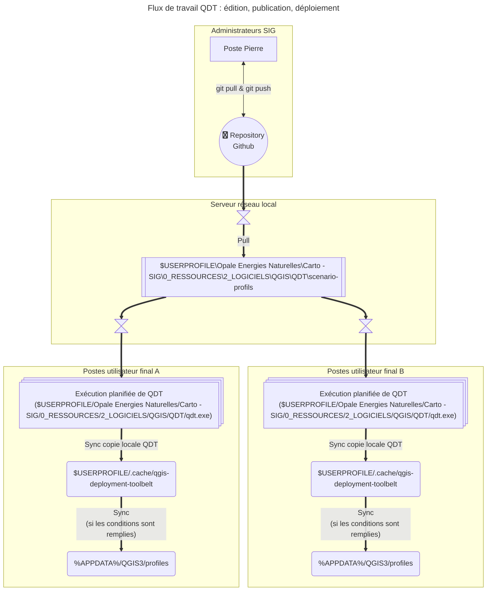

# Profils et scénarios pour QDT

Documentation officielle de QGIS Deployment Toolbelt : <https://qgis-deployment.github.io/qgis-deployment-toolbelt-cli/>

## Workflow et procédure

> [!NOTE]
> Les flèches en gras correspondent aux étapes automatisées (tâche planifiée, GPO...).

### Synchronisation Github --> Serveur réseau local

Une tâche planifiée installée sur l'ordinateur de Pierre se charge de faire un `git pull` depuis GitHub vers l'emplacement sur le réseau local : `$USERPROFILE\Opale Energies Naturelles\Carto - SIG\0_RESSOURCES\2_LOGICIELS\QGIS\QDT\scenario-profils`. C'est ce script de la documentation qui est utilisé : <https://qgis-deployment.github.io/qgis-deployment-toolbelt-cli/guides/howto_manage_private_git.html>.

Pour ce faire, un jeton d'authentification en lecture seule du projet a été créé avec la procédure ci-après :

1. Créer un jeton d'accès <https://github.com/settings/personal-access-tokens/>
1. Remplir le formulaire commme ci-dessous :

  

1. Stocker le jeton dans son gestionnaire de mots de passe
1. Stocker le jeton en variable d'environnement :
    - nom : `QDT_GH_TOKEN_SYNC_PROFILS`
    - valeur : le jeton
1. Entrer le jeton à l'invite du Git Credentials Manager dans l'onglet "Token"
